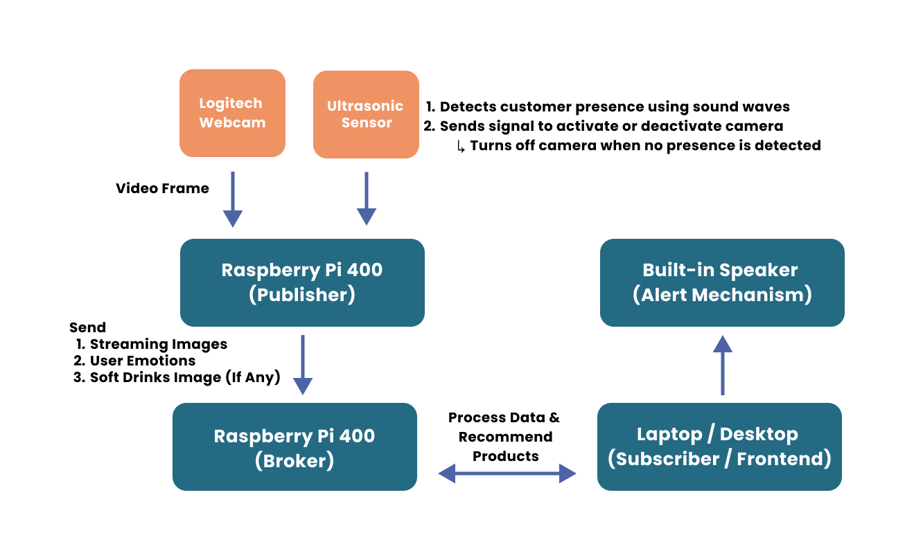

# SenseiStore
SenseiStore is an AI-powered Interactive Retail Solution that can help enhance customer user experience by detecting emotions using a proximity sensor and camera, then provides product recommendations through a UI and speaker system

## Key Features
1. Proximity Detection: Uses ultrasonic sensors to detect customer presence.
2. Emotion Recognition: Analyzes facial expressions via camera input.
3. Product Recommendations: Suggests products based on detected emotion and held item.
4. Text-to-Speech Alerts: Plays voice messages to assist or recommend products.

## System Architecture

- Ultrasonic Sensor detects customer presence and triggers camera activation.
- Raspberry Pi 400 (Publisher) captures images using the Logitech Webcam, analyzes emotions and detects soft drink items.
- Sends data to Raspberry Pi 400 (Broker) via MQTT.
- Laptop/Desktop (Subscriber) processes data and makes product recommendations.
- Recommendations are displayed and announced via a Built-in Speaker.
  
## Models Experimented
| Model             | Purpose         | Total Inference Time Per Frame|
|-------------------|-----------------|-------------|
| RetinaFace        | Face Detection  | ~200ms - ~300ms 
| yolov11m-face     | Face Detection  | ~1200ms - ~1300ms
| yolov11n-face     | Face Detection  | ~180ms - ~220ms |
| deepface          | Emotion Detection  | ~40ms - ~47ms |
| yolov11n          | Item Detection  | ~200ms - ~ 300ms |

## Tech Stack
1. Language: Python
2. Protocols: MQTT for inter-device communication
3. Frameworks: Flask (Web UI & API), Flask-SocketIO (Real-time comms)
4. AI Libraries: OpenCV, DeepFace, YOLOv11 , RetinaFace
5. TTS: gTTS for speech synthesis

## Hardware Used
1. Raspberry Pi 400 x2 (x1 Broker, x1 Publisher)
2. Logitech C310 HD WebCam (HD 720p/30fps)
3. Laptop Or Desktop (x1 Subscriber/Frontend)
4. Ultrasonic Sensor (HC-SR04)
   
## Resource Optimization 
| Resource  | Optimization Strategy |
| -------------      | ------------- |
| CPU & Memory       | Lightweight models like DeepFace and YOLO-N reduce computation load  , htop to view resouce ultilization |
| Power Consumption  | Ultrasonic sensor disables camera when no presence is detected  |

## Scalability and Flexibility 
The system supports horizontal scaling by adding more publisher devices (Raspberry Pis) and can accommodate future upgrades such as:
1. Implement Recommender System (Item-Item, User-User collaborative filtering)
2. Extend More Product Categories (Not Limited To Berverages Type Only)
3. Cloud integration for analytics
4. Inventory Tracking
5. Demographic-Based Data Collection
6. Demand forecasting 
7. Eye Gazing Detection
8. Time Tracking

## Setup Instructions

#### For Subscriber (To View The Website):
```bash
git clone https://github.com/your-username/SenseiStore.git
cd SenseiStore
python3 -m venv venv
venv\Script\Activate # For Windows
pip install -r requirements.txt
cd SenseiStore
py main.py
```

#### For MQTT Broker
Follow [PiBroker.md](PiBroker.md) for detailed hardware setup and ensure that you follow correctly

#### For MQTT Publisher:
Follow PiPublisher.md](PiPublisher.md) for detailed hardware setup and ensure that you follow correctly

## Troubleshooting 
1. **Connectivity Issues**:
   - Verify all devices are on the same network or can route to each other (Connected To Same Hotspot, ip route...etc)
   - Check firewall settings for required ports , ensure that there are not occupied 
   - Test connectivity with `ping`commands to ensure that each device can talk to one another 

2. **System Resource Limitations**:
   - Monitor CPU, memory, and storage on all devices
   - Reduce workload on resource-constrained devices by lowering frame rates or detection frequency

3. **Raspiberry PI 400 Set Up**:
   - See [PiBroker.md](PiBroker.md) or [PiPublisher.md](PiPublisher.md) for detailed hardware setup and ensure that you follow correctly

4. **Check IP Addresses Of Devices**:
   - Sometimes When connecting to your own hotspot , the ip addresses may change due to DHCP
   - Download Net Analyzer Application to find out your connected devices IP Addresses
   - Change the ip address of your code , if you notice there is a change of Ip address
   
## Risk Assessment and Mitigation
| Potential Risks/Challenges  | Mitigation Strategy |
| -------------      | ------------- |
| MQTT broker overload with many publishers when the system gets bigger  | Use a scalable broker like Mosquitto or shift to cloud-based broker (e.g., HiveMQ) |
| System latency affecting real-time interaction | Optimize AI models for edge computing through quantisation; implement efficient code and parallel processing techniques |
| Power interruptions affecting system functionality | Implement backup power solutions; design graceful shutdown and recovery procedures. |

## Security Considerations
1. **Data Privacy**: No facial images or personal data are stored. Only video frame , emotion and product inferences are transmitted
2. **MQTT Authentication**: Only authorized clients can connect using username and password credentials.
3. **MQTT ACLs (Access Control Lists)**: Specific MQTT topics are protected to restrict unauthorized publishing or subscribing.
4. **MQTT TLS Encryption**: Communication can be encrypted to ensure message confidentiality and integrity.
